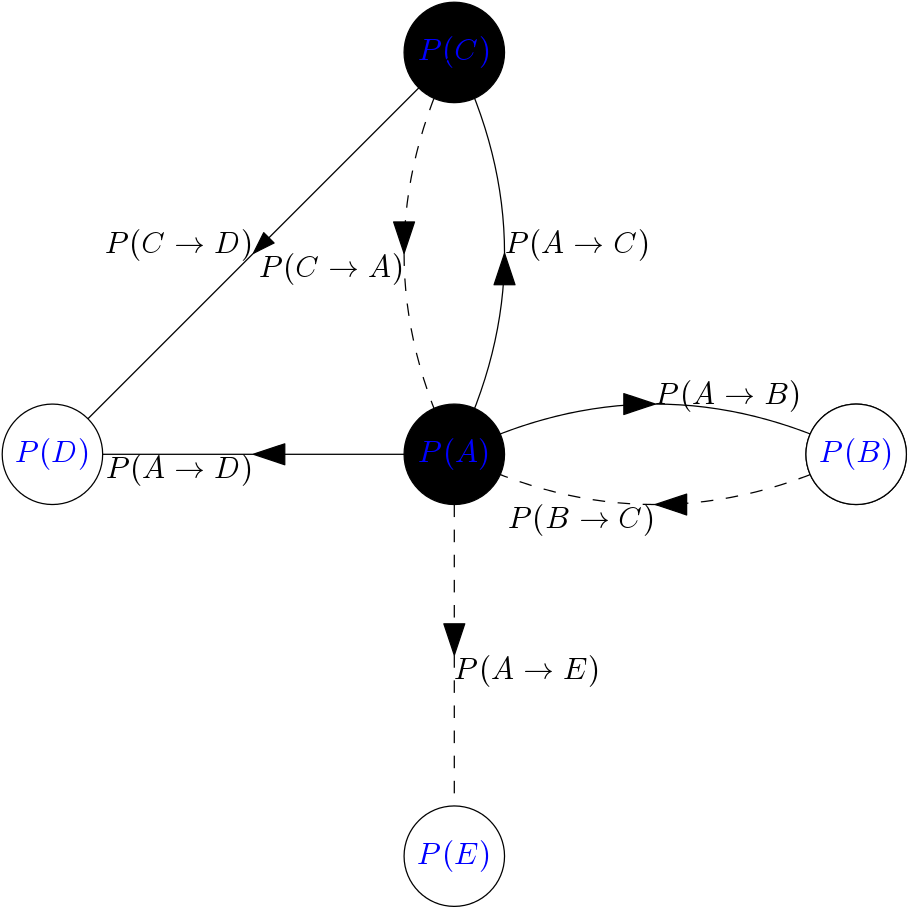

<h1>Twitter Influencers</h1>

    The aim of the project is to calculate a twitter user's influencing power.
    It uses the twitter follower network to do this calclation.
    Below the model will be explained. Clicking on the 'Data' tab will show the resutls.

    The main goal is to create a model which can accurately simulate the spreading of a post.
    Then use this model to predict which users have greater influence by measuring their influence on a scale from 0 to 1.
    The basis of this model is to give each user some level of skepticism.
    Then simulate a post's spread using invasion percolation.

    The twitter follower network will be modeled as a directed graph with edges going from followed to followers and nodes representing each user.
    As shown by the black arrows and circles. Open edges represent followers who have seen the post.
    Open nodes are users who have shared the post.
    The probability of an edge being open is uniformly chosen to be between 0 and 1.
    The probability of a node being open is based on the number of times they have seen the post.
    Each user is given a skepticism level and a minimum probability of sharing the post.
    

    The figure to the left shows a small example of the Twitter network. Users A and C have shared the post.
    User D has seen the most twice, user B has seen it once and user E hasn't seen it at all.
    When a user is created their skepticism, g, and minimum sharing probability, pm, are chosen randomly.
    pm is randomly chosen between 0 and 0.423088 uniformly.
    While g follows an exponential distribution of e^(2/ln(2)).
    These number where chosen such that when a user sees the post twice the average probability of sharing the post is about 0.5.

    Invasion percolation is a Monte-Carlo type simulation where the post is spread across the least 'resistant' path.
    The least resistant path is the one with the smallest associated weight.
    Where the weight is equal to the probability of it being open.
    This means the real life probability is equal to 1-p and is more of a 'pseudo'-probability.
    At each time step the node or edge with the smallest weight is chosen to be opened
    and the largest weight component (the p-value) is recorded along with the number of open nodes.
    The simulation stop once the number of open nodes is large. It is then repeated to obtain an average.

    Once the simulation is finished the data is analysed. The analysed data can be seen in the data tab.
    The influence power is calculated by extrapolating the p-value versus size data using the function
    S(p) = C + A / (pc - p) ** d, where A,C,d and pc are fitting parameters and pc is the extrapolated influence power.
    Prior to the fitting the data is first averaged over. This is done by sectioning the data into 120 groups.
    The middle p-value is found along with the average size creating a new averaged data set.
    The p-value which has the largest size is found and all data points with a higher p-value are ignored.
    This final data set is used to calculated the influence power.

    The main issue with this project is time. In order to get all the data required from Twitter their API must be used.
    However, this API only allows 1 request per minute asking for a list of 1,000 followers from a given user.
    These results are saved for faster future times, but in order to map out all of twitter at this rate it would take
    about 100 years of time. If you would like to contribute to this project you can download the code from github linked below.
    You then need to get an Twitter API 2 account and edit the twitter_secrets.json file replacing the "A"s with your numbers.
    Upon running the code you will automatically update the data lists and cache values which can then be merged.

    You can email me at <a href ="mailto: michael.woolls@mg.thedataincubator.com">michael.woolls@mg.thedataincubator.com</a> with questions and requests.

<h3>How to use:</h3>

    This is a simply python program. However, before you use it you must have access to the Twitter API. 
    This program uses the updated API. You can then edit the twitter_secrets.json file replacing the "A"s with your numbers.
    In order to select which user's you want to calculate the power for change the names list at the top of the main.py file.
    The calculation can time a long amount of time due to the limit placed by the Twitter API.
    After the data is collected it will be added to already calculated runs. This will then be used to calculate a new influence number.
    A new graph for the user will be created and an updated version of follower_power.html will also be created.

<h4>External Site: <a href="https://github.com/MDWoolls/TwitterInfluencers">MDWoolls/TwitterInfluencers</a></h4>
	